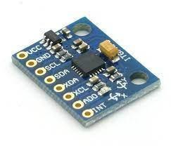

<html> 
        <h1>Fast-Fourier-Transform-Python</h1> 
	<h2>Data were collected with the Modular Analyzer (LVI-UFCG) developed at LVI (Vibration and Instrumentation Laboratory).</h2>

<h2> Créditos:  
<ul>
    <li>Sávio Mateus Ferreira Pessoa - savio.pessoa@ufcg.edu.br</li>
    <li>Dr. Richard Senko(Research advisor for the development of the Modular Analyzer) - richard.senko@ufcg.edu.br</li>
    <li>Dr. Antonio Almeida(LVI coordinator)</li>
    </ul> </h2>
    
<h2>The presented routine calculates the FFT (Fast Fourier Transform) of a signal collected with the accelerometer MPU6050, the signal was generated and applied through a shaker.
	<h2 align = "center">Figure 1 - MPU6050.   
        	

            		
        	

    	</h2>
	</h2>
	
<h2>The FFT provides an analysis with other eyes of the vibration signal in this case showing the frequency at which the shaker was working.
  In the notebook posted in this repository it is possible to see the original signal and the treated signal.
</h2>
    
    	
<h2>Experiment and algorithm by José Sávyo Soares Lira - josesavyo.lira@ee.ufcg.edu.br</h2>
	
<h2 align="center">Social Contacts  
        

        
         
        

		
</h2>	
	

</html>
